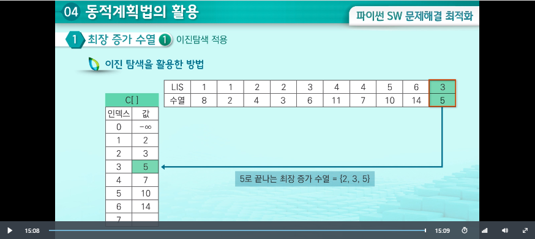

# 동적계획법의 활용

## 01 최장 증가 수열

-   어떤 수열이 왼쪽 -> 오른쪽으로 나열되어 잇으면 그 나열 순서를 유지하면서 크기가 점진적으로 커지는 가장 긴 부분 수열을 추출하는 문제(연속적 or 비연속적)

    -   예) 3 2 6 4 5 1
    -   ==> 2 4 5
    -   길이가 3인 최장 증가 수열

-   완전 검색 적용(O(2^N))

    -   수열의 모든 부분 집합 구하기
    -   해당 부분 집합이 증가 수열 여부 판별
    -   증가 수열 중 가장 길이가 긴 값을 구함

-   다른 방법(O(n^2))

    -   LIS[i] = a[i]로 끝나는 최장 증가 수열의 길이
    -   따라서 LIS[i] = max(a[j] + 1), 이때 j는 a[j]< a[i]인 모든 j

-   이진탐색 적용(O(nlogn))
    -   C[k] = 길이 k의 증가 수열에 대해 가장 작은 값을 C[k]에 저장
    -   각 위치에서 C[i]를 갱신하기 item에 근접한 작은 값을 찾기 위해 이진 탐색 수행, 그 작은 값 바로 다음에 item을 저장, LIS 갱신
    -   따라서 max(LIS[])가 답.  
        

## 02 모든 쌍 최단 경로 문제

-   최단 경로 문제 vs 모든 쌍 최단 경로 문제

    -   최단 경로 문제: 한 도시에서 다른 도시로 직항로가 없는 경우 가장 빨리 갈 수 있는 항로를 찾는 문제
    -   모든 쌍 최단 경로 문제: 모든 도시 사이에 가장 빨리 갈 수 있는 항로를 찾는 문제
        -   가중치 포함, 방향성 그래프
        -   최적화 문제

-   Brute-Force 접근 방법

    -   한 정점에서 다른 정점으로의 모든 경로의 길이를 구한 뒤, 그들 중에서 최소길이를 찾음
    -   그래프가 n개의 정점을 가지고 있고, 완전그래프라고 가정할 경우 총 경로의 개수는 (n-2)!
        상당히 비효율적이라는 것을 알 수 있음

-   다익스트라 알고리즘

    -   각 정점을 시작점으로 정함
    -   시간복잡도는 O(n^3)
    -   워샬: 그래프에서 모든 쌍의 경로 존재 여부를 찾아내는 동적 계획 알고리즘 제안  
        플로이드: 동적 계획 알고리즘을 변형하여 모든 쌍 최단 경로를 찾는 알고리즘 고안
    -   플로이드-워샬 알고리즘: 모든 쌍 최단 경로를 찾는 동적 계획 알고리즘
        -   O(n^3), 동적 계획법 적용

-   https://hsp1116.tistory.com/45 참고하기

## 03 순회 외판원 문제(TSP)

-   소개

    -   외판원이 자신의 집이 위치하고 있는 도시에서 출발
    -   다른 도시들을 각각 한번씩만 방문
    -   다시 자기 도시로 돌아오는 가장 짧은 일주여행경로 결정

    -   대상: 음이 아닌 가중치가 있는, 방향성 그래프
    -   그래프 상에서 일주여행경로
    -   최적일주여행경로(Optimal tour)

*   무작정 알고리즘
    -   비효율적이다.
    -   동적 계획법 알고리즘이 더 나음

-   동적 계획법 알고리즘
    -   V는 모든 정점의 집합, A는 V의 부분집합
    -   D[vi][a]는 A에 속한 각 정점을 정확히 한번씩만 거쳐서 vi에서 v1으로 가는 최단 경로
    -   식
        -   D[v1][v-{v1}] = min(W[1][j] + D[vj][v-{v1,vj}])
        -   이때 W[1][j] + D[vj][v-{v1,vj}]는 vj를 뺏을 때 경로 길이의 합
    -   시간 복잡도: O(n^2\*2^n)
    -   이때 비트테이블 이용
        -   TODO: 비트테이블 설명하기
