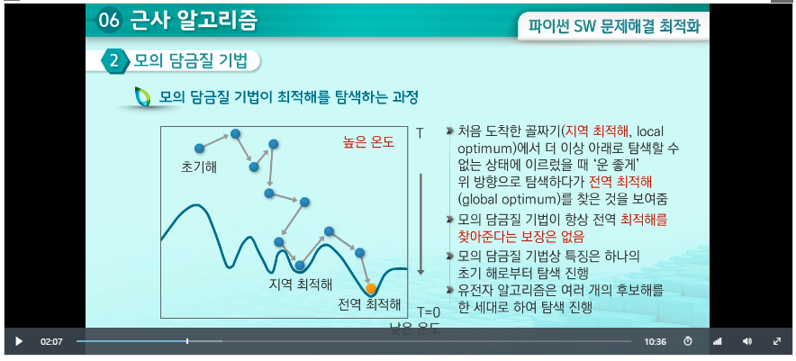
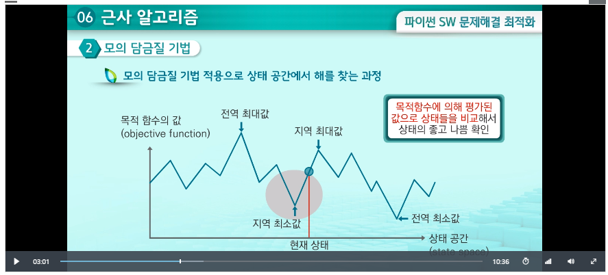
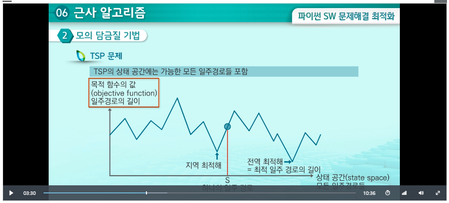
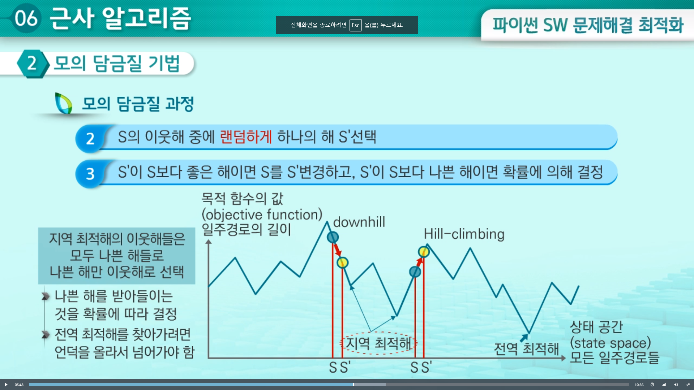

# 근사 알고리즘

## 01 근사해

### 1. 소개

-   np-complete 문제들
    -   다항식 시간에 해결할 수 있는 알고리즘 미 발견, 미 증명
    -   존재하지 않는다고 추측
    -   다음 3가지 중 1가지는 포기해야 함.
        -   다항식 시간에 해를 찾는 것
        -   모든 입력에 대해 해를 찾는 것
        -   **최적해를 찾는 것**

### 2. 근사 알고리즘

-   np-complete 문제들을 풀 때 최적해를 찾는 것을 포기하고 근사해를 찾을 때 쓰는 알고리즘
-   대신 다항식 시간의 복잡도를 가짐
-   근사 비율
    -   근사해의 값과 최적해의 값의 비율, 1.0에 가까울수록 정확도가 높은 알고리즘
    -   계산하려면 최적해를 알아야 하는 모순이 생김
    -   최적해를 대신할 수 있는 **'간접적인' 최적해**를 찾고, '간접적인' 최적해를 최적해로 삼아서 근사 비율을 계산

### 3. 적용: TSP 문제

-   문제의 조건

    -   대칭성: A->B 거리 == B->A 거리
    -   (A->B 거리) < (A->C거리 + C->B거리)

-   근사 알고리즘

    -   다항식 시간 알고리즘을 가지면서 유사한 특성을 가지는 문제 찾기: **최소 신장 트리(minimum spanning tree: MST)**

        -   주어진 그래프에서 mst를 우선 찾음
        -   mst를 깊이 우선 탐색(dfs)
            -   탐색 과정에서 방문하면서 돌아오는 과정을 기록하고 중복되는 정점을 제거

    -   정리

        -   입력 그래프에서 mst를 찾는다
        -   mst에서 임의의 시작 정점에서부터 깊이 우선 탐색(DFS)하면서 방문하는 정점들의 순서를 기록(돌아오는 과정에 방문하는 정점들도 기록)
        -   앞 과정에서 중복된 정점을 제거(마지막의 시작 정점은 제거X)

    -   시간 복잡도
        -   mst: 프림/크루스칼 알고리즘만큼.
        -   트리 간선을 따라 정점의 방문 순서를 찾는 데 O(n)
        -   중복 정점 제거: O(n)
        -   즉 O(mlogn)
    -   근사 비율
        -   tsp 문제의 최적해를 실질적으로 알 수 없으므로, 간접적인 최적해인 mst 간선의 가중치의 합(M)을 최적해의 값으로 활용
            -   실제의 최적해의 값 > M
        -   근사 알고리즘이 계산한 근사해의 값은 2M보다는 크지 않음
            -   mst의 간선을 따라서 정점의 방ㄹ문 순서를 찾을 때 사용된 트리 간선: 각 간선 2번 사용
        -   근사 비율 = 2를 넘지 않음
            -   삼각부등식을 만족하지 않을 때 보장X

### 4. 적용: 작업 스케줄링 문제

-   그리디 방법

    -   가장 빨리 끝나는 일을 기계에 배정

-   근사 알고리즘

    -   과정

        -   n개의 작업을 하나씩 가장 빨리 끝나는 기계에 배정
        -   기계를 찾기 위해 for 루프 (m-1)회 수행(m: 기계의 수)
        -   마지막에 모든 기계의 작업 종료 시간 중에 최대값을 찾아야 하므로 O(m) 시간이 걸림.
        -   시간복잡도는 n개의 작업을 배정하고, 마지막에 리스트 L 탐색
            -   n \* O(m) + O(m) = O(nm)

    -   근사비율: OTP': 근사해, 최적해: OTP일떄, OTP' <= 2\*OTP
    -   근사해< 2\*최적해

## 02 모의 담금질 기법

### 1. 소개

-   높은 온도에서 액체 상태인 물질이 온도가 낮아지면서 결정체로 변하는 과정을 모방해 해를 탐색하는 알고리즘
-   해를 찾기 위한 확률적인 접근 방식

-   용융 상태: 물질의 분자가 자유로이 움직임, but when temp decrease, 분자의 움직임이 점점 줄어 결정체가 됨
-   모의 담금질 기법: 이와 유사하게 점점 더 규칙적인 방식으로 진행.
    

### 2. 모의 담금질 기법

-   상태 공간에서 해를 찾는 과정
    

### 3. 적용: TSP 문제

-   과정
    -   초기에 임의의 해 S 선택
    -   다음 과정 반복:
        -   S의 이웃해 중에 랜덤하게 하나의 해 'S' 선택
        -   S'이 S보다 좋은 해: S=>S'으로 변경
        -   S'이 S보다 나쁜 해: 확률에 의해 S'을 S로 받아들일지 결정
    -   반복이 종료되면 S를 해로 선택

